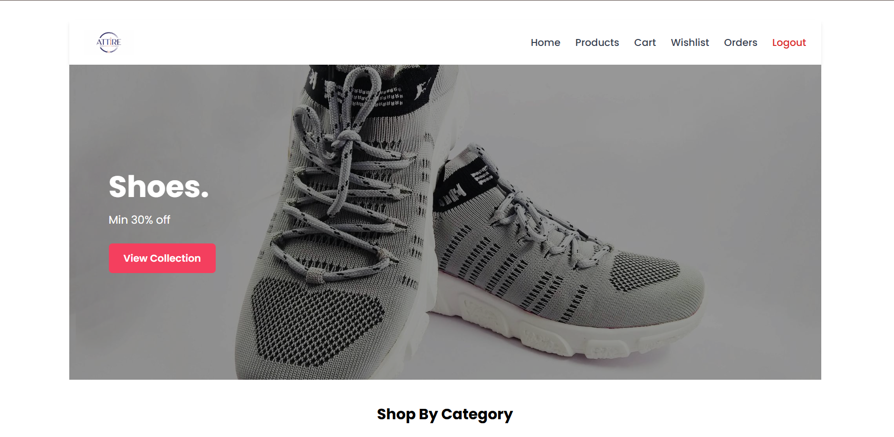
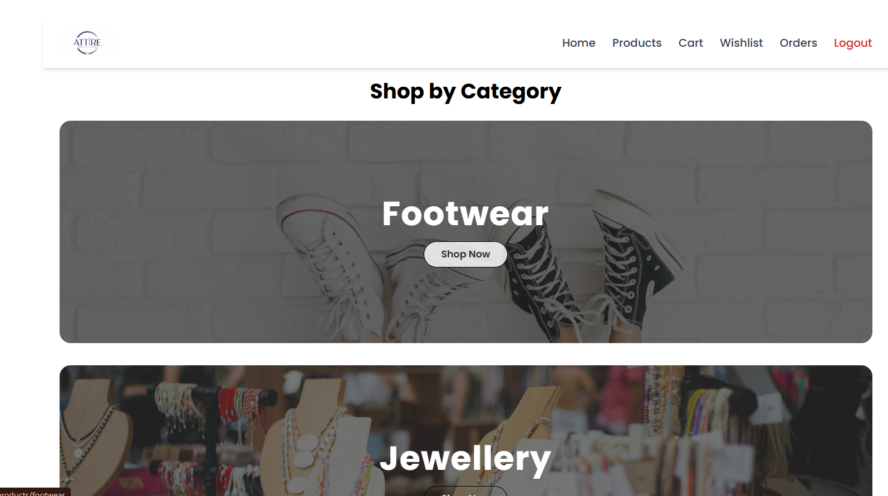
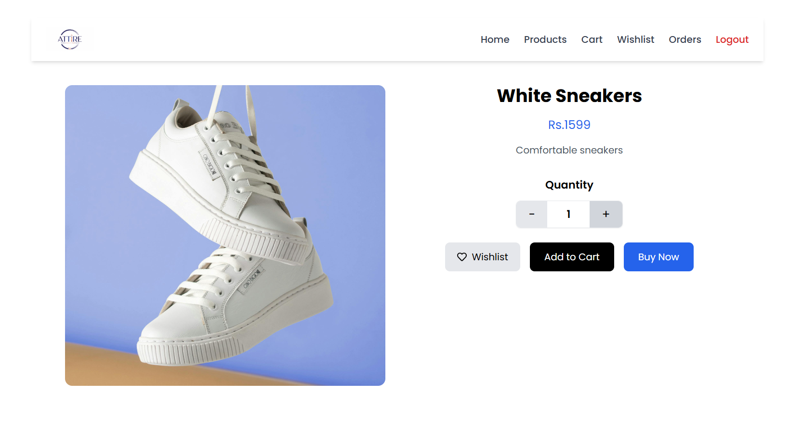
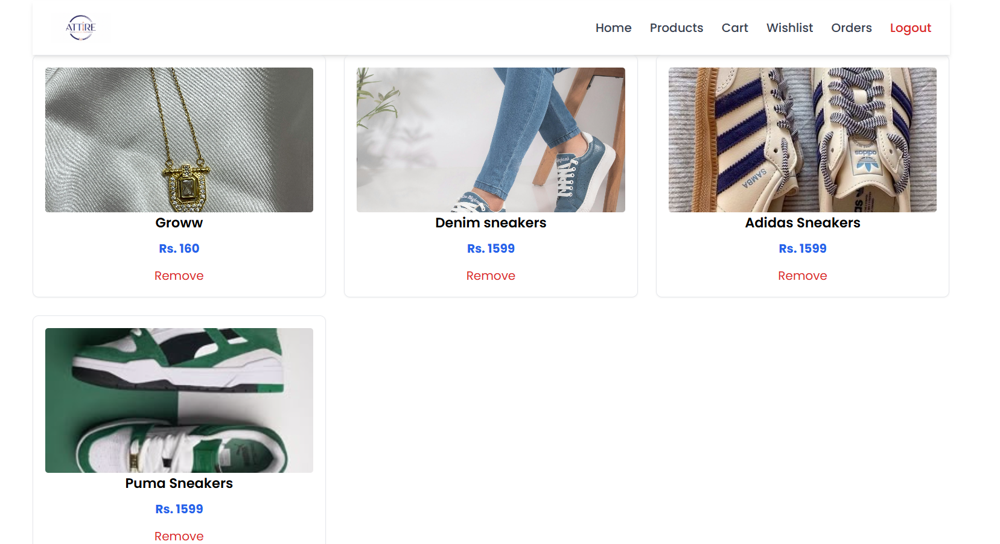
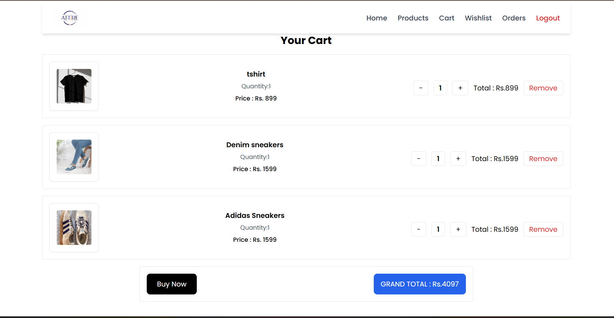
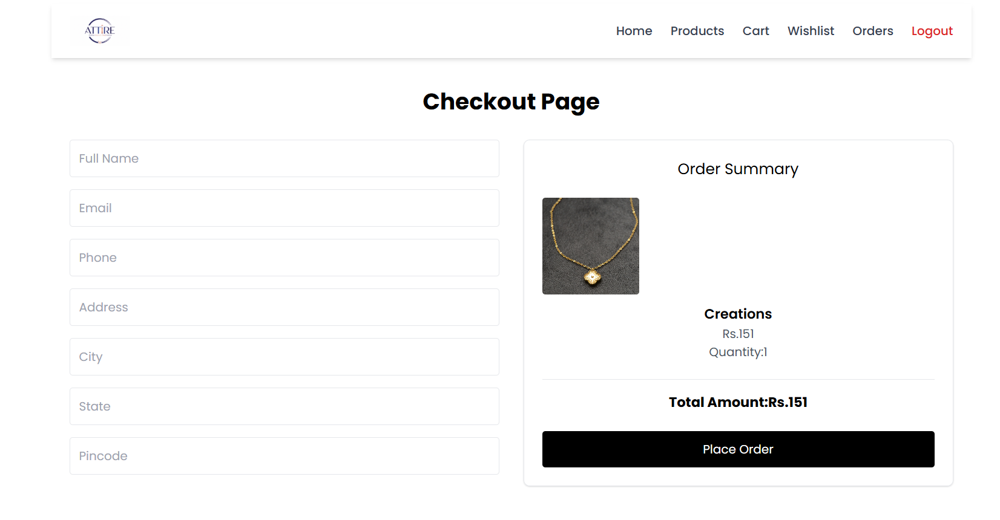
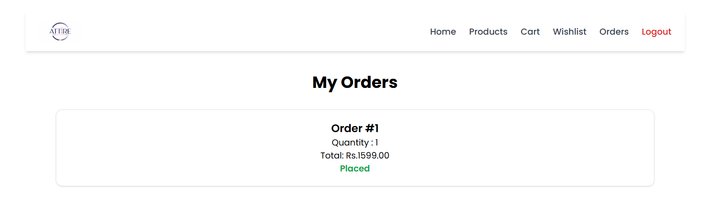

# E-Commerce Fashion Frontend

A modern full-stack fashion e-commerce frontend built using React.js, Tailwind CSS, Redux Toolkit, and React Router. This project provides a complete shopping experience including authentication,  wishlist, cart management, checkout , Razorpay payment integration, and viewing orders.

---

## Features

- User Authentication (Login & Signup)
- Product Categories
- Product Detail Page
- Wishlist Functionality
- Add to Cart
- Quantity Update
- Checkout System
- Razorpay Payment Integration
- Order Success Page
- Orders History Page
- Responsive UI Design
- Redux State Management
- Dynamic Routing using React Router

---

## Technologies Used

### Frontend

- React.js
- Tailwind CSS
- Redux Toolkit
- React Router DOM
- Axios
- React Icons

### Backend (Connected API)

- Django
- Django REST Framework
- SQLite

## Core Functionalities

### Cart System
- Add products to cart
- Remove items from cart
- Quantity management

### Wishlist System
- Add/remove products from wishlist
- Persistent wishlist state

### Orders System
- Place orders after successful payment
- View previous orders

## Project Structure

```
src/
|
|--- assets/
|    |--- banners/
|    |--- categories/
|    |---home-category/
|    |---screenshots/
|--- components/
|    |--- Footer.jsx
|    |--- HeroBanner.jsx
|    |--- NavBar.jsx
|    |--- ProductCard.jsx
|    |--- ShopByCategory.jsx
|--- data/
|    |--- products.json
|--- layouts/
|    |--- MainLayout.jsx
|--- pages/
|    |---Cart.jsx
|    |--- CategoryProducts.jsx
|    |--- Checkout.jsx
|    |--- Home.jsx
|    |--- Login.jsx
|    |--- Orders.jsx
|    |--- OrderSuccess.jsx
|    |--- ProductDetail.jsx
|    |--- Products.jsx
|    |--- Signup.jsx
|    |--- Wishlist.jsx
|--- redux/
|    |--- slices/
|         |--- authSlice.js
|         |--- cartSlice.js
|         |--- wishlistSlice.js
|    |--- store.js
|--- utils
|    |--- api.js
|    |--- localStorage.js
|--- App.css
|--- App.jsx
|--- index.css
|--- main.jsx
|--- App.jsx

```
### Screenshots

- Homepage

  

- Products

  

- Product Detail

  

- Wishlist

  

- Cart

  

- Checkout

  
  
- Orders

  
 


## Payment Integration
This project uses Razorpay Test Mode for payment integration.

Features:

- Razorpay Checkout Popup
- Test Payment Flow
- Order Creation After Successful Payment


## Note

This project is built for learning purposes to practice real-world full-stack e-commerce development concepts.


